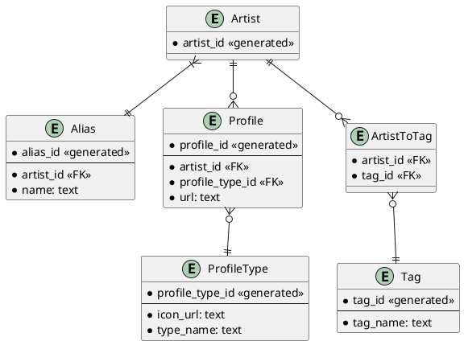

This model was created and used to plan the structure of the data that will be saved in the database.
The actual structure will however be the defined by the used ORM in the backend-application.

```plantuml
@startuml

entity Artist {
	* artist_id <<generated>>
}

entity Alias {
	* alias_id <<generated>>
	--
	* artist_id <<FK>>
	* name: text
}

entity Profile {
	* profile_id <<generated>>
	--
	* artist_id <<FK>>
	* profile_type_id <<FK>>
	* url: text
}

entity ProfileType {
	* profile_type_id <<generated>>
	--
	* icon_url: text
	* type_name: text
}

entity Tag {
	* tag_id <<generated>>
	--
	* tag_name: text
}

entity ArtistToTag {
	* artist_id <<FK>>
	* tag_id <<FK>>
}

Artist }|--|| Alias
Artist ||--o{ Profile
Profile }o--|| ProfileType
Artist ||--o{ ArtistToTag
ArtistToTag }o--|| Tag

@enduml
```