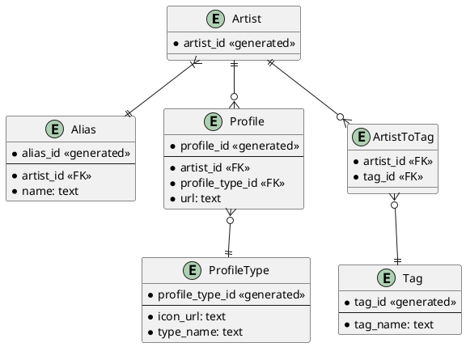

```plantuml
@startuml

entity Artist {
	* artist_id <<generated>>
}

entity Alias {
	* alias_id <<generated>>
	--
	* artist_id <<FK>>
	* name: text
}

entity Profile {
	* profile_id <<generated>>
	--
	* artist_id <<FK>>
	* profile_type_id <<FK>>
	* url: text
}

entity ProfileType {
	* profile_type_id <<generated>>
	--
	* icon_url: text
	* type_name: text
}

entity Tag {
	* tag_id <<generated>>
	--
	* tag_name: text
}

entity ArtistToTag {
	* artist_id <<FK>>
	* tag_id <<FK>>
}

Artist }|--|| Alias
Artist ||--o{ Profile
Profile }o--|| ProfileType
Artist ||--o{ ArtistToTag
ArtistToTag }o--|| Tag

@enduml
```