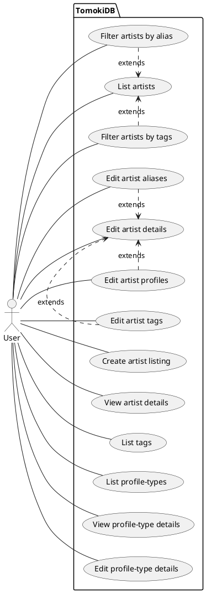

```plantuml
@startuml
left to right direction
actor User as u
package TomokiDB {
	(List artists) as (UC1)
	(Filter artists by alias) as (UC2)
	(Filter artists by tags) as (UC3)
	(Create artist listing) as (UC4)
	(View artist details) as (UC5)
	(Edit artist details) as (UC6)
	(Edit artist aliases) as (UC7)
	(Edit artist profiles) as (UC8)
	(Edit artist tags) as (UC9)
	(List tags) as (UC10)
	(List profile-types) as (UC11)
	(View profile-type details) as (UC12)
	(Edit profile-type details) as (UC13)
}
u -- (UC1)
u -- (UC2)
(UC2) .> (UC1) : extends
u -- (UC3)
(UC3) .> (UC1) : extends
u -- (UC4)
u -- (UC5)
u -- (UC6)
u -- (UC7)
(UC7) .> (UC6) : extends
u -- (UC8)
(UC8) .> (UC6) : extends
u -- (UC9)
(UC9) .> (UC6) : extends
u -- (UC10)
u -- (UC11)
u -- (UC12)
u -- (UC13)
@enduml
```